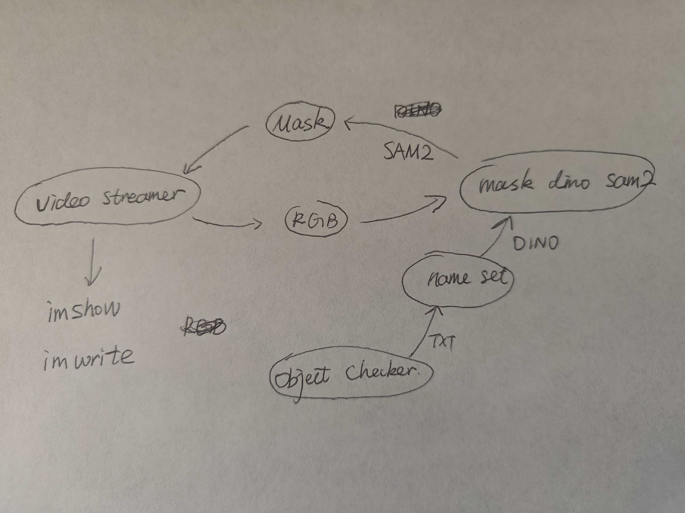

# Install streaming grounded sam2 enviroment
```shell
conda create --name dino_sam2 python=3.11

conda activate dino_sam2

# this adds the conda-forge channel to the new created environment configuration 
conda config --env --add channels conda-forge
# and the robostack channel
conda config --env --add channels robostack-staging
# remove the defaults channel just in case, this might return an error if it is not in the list which is ok
conda config --env --remove channels defaults

# Install ros-noetic into the environment (ROS1)
mamba install ros-noetic-desktop

conda deactivate
conda activate dino_sam2

mamba install compilers cmake pkg-config make ninja colcon-common-extensions catkin_tools rosdep
```

## Oct. 10


# Oct. 17



TODO:
- [ ] It stills has problem when trying to run SAM2 in ROS.

```
RuntimeError: No available kernel. Aborting execution.
```